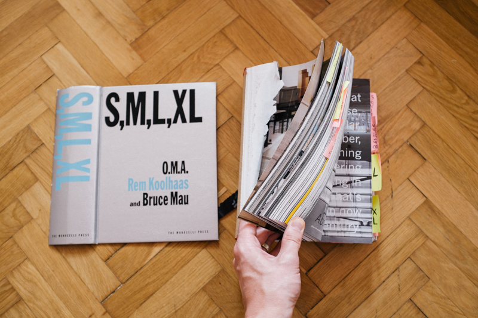
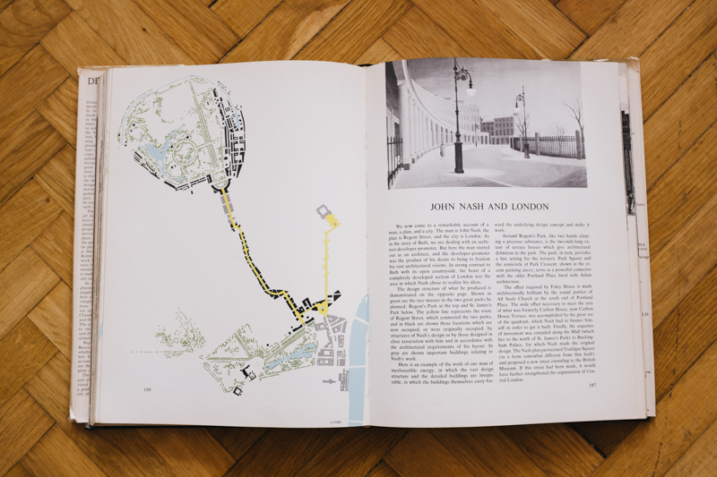

I've been out and about architecture for a while.

I frequently am asked to give book recommendations, and frequently see people
asking for book recommendations on the internet. In this overview, I'll compile
some of my answers.

## Introduction

I used to run an architecture themed reading[^atrap] group while still in
architecture school.

The reading group grew out of a frustration that as students of architecture
whose task it was to design buildings relevant to the present, did not have a
platform to discuss present contemporary architecture. History classes start
with Egypt, meaning that you only cover the 20th century in your last year of
studies There is nothing wrong with the way history is taught, but it means
that, for the majority of students, exposure to contemporary architecture lies
solely in the hands of a few resources of questionable quality (archi-spam
blogs especially).

The reading group, then, had a double mission of reflection on what's going on
now, and at the same time providing the tools necessary to be able to have the
discussion: a knowledge of 20th century architecture. There was [an
introduction](http://atrap.org/about.html), a list of
[principles]http://atrap.org/principles.html) and a
[curriculum](http://atrap.org/curriculum.html).

If there is one thing to stress from those three pages, it is from the
principles page:

> Primary texts meaning texts that are 0 degrees of separation from the subject
> matter. This means that we concentrate on texts written by architects that
> explain what they were doing, or texts written by theorists which then went
> on the inform what architects were doing. We look at texts that are of the
> time when they were relevant, not recapitulations and interpretations of
> secondary actors on the work of others.

On to the lists then.

## Frequently recommended books

I don't like the idea of a must have list, everyone can chose what to read, but
these are books that I believe are of such high quality, importance or
usefulness that they can only bring merit. These books should be good presents
for any architect.

### Books by Architects

#### S, M, M, XL by OMA (Rem Koolhaas)

Amazon: [UK](http://www.amazon.co.uk/gp/product/1885254865/ref=as_li_tl?ie=UTF8&camp=1634&creative=19450&creativeASIN=1885254865&linkCode=as2&tag=zmlka-21&linkId=OJRQYJHV2U3T3EGY) 
and [US](http://www.amazon.com/gp/product/1885254865/ref=as_li_tl?ie=UTF8&camp=1789&creative=390957&creativeASIN=1885254865&linkCode=as2&tag=wwwzmlkacom-20&linkId=2E4U57GWC6ZAIGH7)

That's a picture of my battered copy of the book. First read before even starting
architecture studies, enjoyed it very much at the time. I flip through it
regularly.

Although S, M, L, XL is a monograph of a single office, what makes it so
appealing and gives it such «replay value» is that Koolhaas is an
exceptionally gifted writer as well as being deeply ingrained in today's
architecture world. Being familiar with OMA's output is a practically mandatory
for understanding contemporary architecture. The more you know,
the more you can get out of the book, as it is far more than just project
documentation.  Full anecdotes, related and unrelated thoughts, essays and
thoughts. 

Creating the tome was a massive undertaking, as is reading it.

#### Design of Cities by Edmund Bacon

Amazon: [UK](http://www.amazon.co.uk/gp/product/0140042369/ref=as_li_tl?ie=UTF8&camp=1634&creative=19450&creativeASIN=0140042369&linkCode=as2&tag=zmlka-21&linkId=HMB4I5ZOP4CBYUMY) 
and [US](http://www.amazon.com/gp/product/0140042369/ref=as_li_tl?ie=UTF8&camp=1789&creative=390957&creativeASIN=0140042369&linkCode=as2&tag=wwwzmlkacom-20&linkId=LVOMIQ6GEECNYPWU)

The design of cities is exceptionally well structured book on urban design.
Following the travels and learnings of the author, the book is a sequence of
case studies on canonical acts of urbanism. The book stands out for its
clarity of writing but above all its diagrams. Burke's diagrams typically
use three colours at most,  are hand drawn and show selective information, and
perfectly illustrate the point being made.

This book is a great introduction to urban design, as well as an amazing
reference for diagramming ideas.

#### Toward an Architecture by Le Corbusier
Amazon [UK](http://www.amazon.co.uk/gp/product/0711228094/ref=as_li_tl?ie=UTF8&camp=1634&creative=19450&creativeASIN=0711228094&linkCode=as2&tag=zmlka-21&linkId=C3SU6Q5PJVWUZ5VX) 
and [US](http://www.amazon.com/gp/product/0892368225/ref=as_li_tl?ie=UTF8&camp=1789&creative=390957&creativeASIN=0892368225&linkCode=as2&tag=wwwzmlkacom-20&linkId=J5DQ3IRDEN6J5IM3)

There are a couple of translations but be sure to get the John Goodman one
linked above.

In the 20th century, no architect has such referential gravity as Le Corbusier.
While he might not be the most talked about at any given moment, it is his
buildings and writings that managed to capture and inspire much of the
development of architectural thinking in the first half of the century.

Much is said about him, yet most have not even read this short manifesto that
serves as an entry point to making sense of European architecture after World
War I.

### Books of interviews and lectures

Architects often present their work in devious ways.

Anybody who has been through any design course of any kind knows the
tremendous quantity of half-truths and straight-up inventions that are said
during crits, and this spirit of rhetorical invention is often carried forward into professional life. Design ideas are often retconed, initial sketches drawn last, foundational diagrams drawn post-factum. Designers are paradoxically extremely honest and extremely dishonest at the same time.

Reading interviews is sometimes a nice antidote; it feels more real, gives more of an idea of the actual principles of the person being interviewed. That is not to say that the stated principles are followed by them when designing, but it definitely makes for a more engaging read than the usual PR sounding descriptions. Not to mention secondary reading which does all that and more.

[^atrap]: [ATRAP](http://www.atrap.org)

